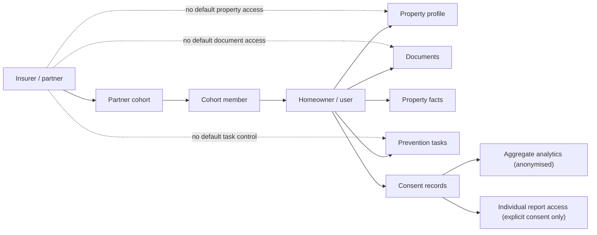

# Homeowner-First Prevention And Partner Access

**Status:** Product governance note
**Owner:** Product / engineering
**Last updated:** 2026-05-30
**Related tickets:** HT-314, HT-315, HT-316, HT-317

## Purpose

This note records the product and access decision that must guide HT-316 before prevention tasks and reminders are implemented.

HomeTruth can support insurer cohorts, but the prevention experience must be useful to the homeowner first. The insurer benefit is downstream: better engagement, clearer aggregate signals, and potentially fewer avoidable issues over time. The in-product experience must not become an insurer compliance checklist.

## Core Principle

Prevention tasks are user-facing home actions, not insurer instructions.

The first useful product loop is:

```text
Property data + evidence + homeowner context -> useful action -> user response -> better property record
```

For the 500-person partner cohort, the task system should help people understand, maintain and improve their home. Partner value should come from consented participation and aggregate insight, not from giving the partner operational control over a person's home record.

## Push Versus Pull

HT-316 should be pull-led.

That means prevention tasks should appear inside HomeTruth where the user is already looking at their property profile, documents, facts, or dashboard. The system can use light in-app prompts such as task counts, due-soon labels, overdue states and status filters.

External push should be deferred until there is a separate decision on:

- notification consent
- channel preference
- frequency limits
- unsubscribe / pause controls
- approved partner and legal copy
- escalation rules for urgent actions

Deferred external push includes email, SMS, partner-app notifications, calendar sync and insurer-triggered nudges.

## Prevention Taxonomy V1

The first task taxonomy should stay conservative, explainable and useful without legal review.

Recommended V1 task types:

- **Service due:** boiler service, electrical check, appliance or system service where evidence exists or a date is known.
- **Seasonal check:** gutter check, roof check, pipe freeze preparation, damp watch, smoke / CO alarm check.
- **Document expiry:** EPC, gas safety certificate, insurance policy, warranty, service certificate, mortgage or renewal document where expiry or review date is known.
- **Missing baseline data:** ask the user to add address, tenure, property type, boiler age, roof age, occupancy, key documents or known issues.
- **Known issue follow-up:** damp, leak, roof, drainage or structural issue where a user-supplied fact or document suggests follow-up.
- **Evidence improvement:** ask the user to confirm or upload evidence for an important property fact.

Avoid V1 tasks that imply regulated advice, partner enforcement, policy conditions, claim decisions, credit decisions or property valuation certainty.

## Product Copy Rules

Use homeowner agency language:

- "Recommended action"
- "Due soon"
- "Needs review"
- "Complete"
- "Dismiss"
- "Not relevant"
- "Add evidence"
- "Review document"

Avoid enforcement or unsupported insurance language:

- "Required by your insurer"
- "Mandatory"
- "Policy risk"
- "Claim reduction"
- "Compliance score"
- "Penalty"
- "Your insurer needs this"
- "This will lower your premium"

No in-product copy should claim HomeTruth reduces claims, lowers severity, lowers premiums or guarantees insurance outcomes unless approved evidence and copy exist.

## Partner And Insurer Role

For the Zurich-style pilot, the insurer should be modelled as a partner/cohort actor, not as a `PropertyPerson` by default.

The core partner objects are:

- `Partner`
- `PartnerCohort`
- `CohortMember`
- `ConsentRecord`

The partner can introduce users, sponsor access, measure cohort engagement and receive governed reporting. The partner should not automatically become a person connected to each property.

Default partner limitations:

- no direct access to property documents
- no direct access to raw property facts
- no direct access to personal profile data
- no ability to create, edit, complete, dismiss or suppress homeowner tasks
- no default view of individual task status
- no default view of psychographic or behavioural profile data
- no direct property access through `PropertyPerson` unless a future explicit-consent product path requires it

Possible future partner access, subject to explicit consent and separate implementation:

- individual HomeTruth report sharing
- policy-specific document sharing
- claim-support evidence pack
- partner-readable summary report
- aggregate cohort analytics
- anonymised prevention engagement metrics

## Consent Boundary

Consent must be explicit, scoped and auditable.

A user's participation in a partner cohort does not automatically consent to sharing their property record, documents, facts, task history or personal profile with the partner.

Minimum consent scopes to model separately:

- cohort participation
- sponsored access / entitlement
- aggregate analytics
- individual report sharing
- document sharing
- partner communications
- external notifications

## Access Shape



## HT-316 Implementation Consequences

HT-316 should implement prevention tasks as homeowner-owned property actions.

Implementation constraints:

- tasks belong to a property and should be assigned to a user/homeowner
- task source should explain the rule, fact, document or evidence that generated it
- task status should support `open`, `completed`, `dismissed` and `not_relevant`
- task status changes can support pilot analytics, but not partner control
- task generation should use known property data, documents, expiry dates, evidence and missing baseline data
- the UI should live in the property profile/dashboard flow
- no external push channel should be implemented in HT-316
- no partner-facing individual task view should be implemented in HT-316
- no unsupported insurer claim-reduction claims should appear in-product

## Open Decisions To Return To

- Which external notification channels should HomeTruth support first?
- What frequency and pause controls are acceptable for prevention reminders?
- Which partner reporting views are useful without exposing individual users?
- What explicit-consent flow is needed for individual report sharing?
- Which prevention categories require insurer, legal or regulated-advice review?
