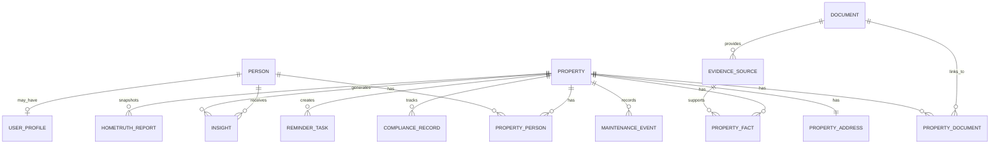

# HomeTruth Domain Model

**Status:** Draft for review  
**Owner:** Product / engineering  
**Last updated:** 2026-05-25  
**Tracking ticket:** HT-307

## Purpose

HomeTruth should be modelled around **property + people**, not around whichever feature was built first. The backend currently stores users, chats, uploaded documents, settings, budget calculations, and bookmarked listings, but it does not yet have a canonical model for the home itself or the different people connected to that home.

This document defines the shared domain language for HomeTruth before backend migrations, APIs, frontend workflows, or enterprise data products are expanded.

## Core Concept

```text
Property Register + People Experience = HomeTruth
```

The property register gives HomeTruth **Width**: every UK residential address can exist as a baseline record before a user claims it.

The people experience gives HomeTruth **Depth**: homeowners, buyers, landlords, investors, contractors, lenders, insurers, and agents enrich, verify, use, and share those records through real workflows.

HomeTruth's product value is created where these two systems meet:

- a national property register / ledger that can hold facts about every home
- an AI-led user experience that helps people understand, update, evidence, and act on those facts
- a trust layer where user participation turns static records into living property intelligence

## Source Material

- `hometruth DOCS/CLAUDE.md` — HomeTruth as the definitive digital record / service log for every home.
- `hometruth DOCS/docs/product/hometruth-product-spec.md` — property information management, maintenance records, compliance, service providers, financial tools, marketplace.
- `hometruth DOCS/docs/product/hometruth-tech-docs.md` and `hometruth-project-knowledge.md` — implementation and MVP context.
- `hometruth DOCS/docs/strategy/hometruth-refined-proposition.md` — document vault, AI property knowledgebase, maintenance scheduling, smart home, compliance.
- `hometruth DOCS/docs/personas/` — first-time buyer, homeowner, landlord, investor, second-home owner, home improvement enthusiast.
- Current backend models/controllers and live MySQL table list.
- NotebookLM domain-model extract supplied in session on 2026-05-25.

## Business-Derived Model

The `property + people` model is not an engineering convenience. It comes from the business material:

- `hometruth DOCS/index.html` states the solution is a dual-flywheel model built on Properties and People: the Property Flywheel creates breadth through a Property Ledger for UK residential addresses; the People Flywheel creates depth through consented, ground-truth homeowner participation.
- `investor-decks/hometruth-width-depth.html` frames the platform as Width x Depth: Width is a record for every UK address; Depth is what accumulates once a homeowner activates HomeTruth through documents, maintenance history, valuations, telemetry, and decisions.
- `monty-hub/02-thesis.html` states that every home is a row from launch: a user is not needed for the address to exist, but a user is needed to make it valuable.
- `monty-hub/06-press-kit.html` describes HomeTruth as turning every UK address into a living digital record made available to homeowners, insurers, lenders, and the wider housing ecosystem.
- `CLAUDE.md` defines HomeTruth as the definitive digital record for every home while also describing homeowner control, insurers, banks, green energy providers, contractors, and property ecosystem partners.
- `hometruth-product-spec.md` describes the platform as serving homeowners, contractors, service providers, and administrators, with property management, maintenance, service provisioning, marketplace, compliance, and financial management.
- `hometruth-refined-proposition.md` positions HomeTruth around homeowners, property investors, and first-time homebuyers, with support for single or multiple properties and documents across the ownership lifecycle.
- `hometruth-project-knowledge.md` frames the product around buyers, homeowners, landlords, vendors, financial products, behavioural context, and long-term property management.
- The persona files explicitly cover first-time buyers, potential homebuyers, new homeowners, existing homeowners, private landlords, property investors, second-home owners, and home improvement enthusiasts.

The business relationship is therefore:

```text
Property register gives Width.
People experience gives Depth.
HomeTruth creates the trusted layer where those two flywheels meet.
```

This is why the model must represent both sides:

- **Property side:** address, UPRN, condition, documents, facts, evidence, maintenance, compliance, insights, reports.
- **People side:** roles, motivations, permissions, consent, communication preferences, behavioural context, responsibilities, decisions.
- **Relationship side:** ownership, buying intent, tenancy, landlord responsibility, contractor work, lender/insurer interest, partner access.

## Modelling Principles

1. **The core model is property + people.** HomeTruth is about homes and the people connected to them: owners, buyers, landlords, tenants, investors, agents, contractors, lenders, insurers, and future occupants.
2. **Address is not identity by itself.** A property needs canonical address fields and should support UK identifiers such as UPRN when available.
3. **Facts need evidence.** Any claim about a property should have a source, date, confidence, and provenance trail.
4. **AI creates proposals, not unquestioned truth.** AI extraction can suggest facts and insights, but evidence and confidence must be preserved.
5. **People-property access is relational.** A person may own, rent, manage, evaluate, finance, insure, service, or invest in many properties; a property can have many people connected to it at once.
6. **The relationship carries meaning.** The important model is not just `user_id` or `property_id`; it is who the person is in relation to the property and what they can see or do.
7. **Graph-ready, not graph-first.** MySQL remains the source of truth for now, but entities, relationship tables, facts, evidence, and source references should be shaped so they can be projected into a knowledge graph later.
8. **Psychographics are not the backbone.** Preference and behavioural profiles can personalise UX, but they should not define the core property truth model.
9. **Speculative business mechanics stay outside the core.** Blockchain anchoring, verifiable contractor credentials, psychographic matching, and enterprise report pulls are later bounded contexts, not the first database foundation.
10. **Privacy and consent are first-class.** Personal profiles, documents, and enterprise data products need explicit consent and retention boundaries.

## Bounded Contexts

| Context | Purpose | Stage |
| --- | --- | --- |
| Property Record | Canonical home identity, address, property attributes, ownership/access links | Core |
| People & Relationships | Users, people, roles, permissions, household/property relationships, consent | Core |
| Document Vault | Uploaded, scraped, or partner-provided documents and extracted metadata | Core |
| Evidence & Provenance | Sources behind property facts, confidence, extraction method, source dates | Core |
| Maintenance & Compliance | Service history, warranties, certificates, compliance deadlines, reminders | Core |
| Insights & Alerts | User-facing recommendations based on property data, documents, risk, and deadlines | Core |
| User Profile & Preferences | Roles, subscriptions, privacy settings, UX preferences, optional behavioural profile | Core / guarded |
| Listings & Market Data | External listings, comparables, valuation signals, EPC and environmental data | Near-term |
| Reports & Sharing | HomeTruth report snapshots, share links, partner-readable summaries | Near-term |
| Marketplace | Contractors, service providers, bookings, ratings, verified work records | Later |
| Enterprise Intelligence | Aggregated/anonymised data products for insurers, lenders, green finance, agents | Later / governed |
| Ledger / Credentials | Hash anchoring, verifiable credentials, tamper evidence | Experimental |

## Canonical Entities

### Person / User

The human actor in the system. In the current backend this starts as `User`, but the domain language should remain broad enough for people who may be connected to a property before they have an account.

Key attributes:
- `id`
- `email`
- `name`
- `account_status`
- `subscription_tier`
- `privacy_settings`

Notes:
- A person can have many different relationships to different properties.
- User role is not enough to understand property access. The relationship to a property is modelled by `PropertyPerson`.

### Property

The canonical home or property asset HomeTruth knows about.

Key attributes:
- `id`
- `property_type`
- `uprn`
- `tenure`
- `status`
- `created_at`
- `updated_at`

Notes:
- `uprn` should be nullable initially but unique when known.
- Avoid a single free-text `home_address` as the property identity.

### Property Address

Canonical address and location data for a property.

Key attributes:
- `property_id`
- `address_line_1`
- `address_line_2`
- `town_city`
- `county`
- `postcode`
- `country`
- `latitude`
- `longitude`
- `source`
- `confidence`

### Property Person

The relationship between a person and a property.

Key attributes:
- `person_id`
- `property_id`
- `relationship_type` (`owner`, `buyer`, `seller`, `landlord`, `tenant`, `investor`, `agent`, `manager`, `contractor`, `lender`, `insurer`)
- `is_primary`
- `start_date`
- `end_date`
- `permission_level`
- `verification_status`

Notes:
- The first backend implementation may use `user_properties` because the current system only has authenticated users. The domain concept is broader: property-connected people.

### Document

A file or source record available to HomeTruth.

Key attributes:
- `id`
- `uploaded_by_user_id`
- `storage_uri`
- `file_name`
- `file_type`
- `file_size`
- `document_type`
- `document_category`
- `source_type` (`upload`, `url`, `partner`, `generated`)
- `ocr_status`
- `extracted_text_uri`
- `retention_status`

### Property Document

The link between a document and a property.

Key attributes:
- `property_id`
- `document_id`
- `linked_by_user_id`
- `relevance`
- `effective_date`
- `expiry_date`

Notes:
- A single document can support multiple property facts.

### Evidence Source

A specific source behind a property fact or insight.

Key attributes:
- `id`
- `document_id`
- `source_url`
- `source_name`
- `source_date`
- `extraction_method` (`manual`, `ocr`, `ai`, `partner_api`, `system`)
- `confidence`
- `excerpt`

### Property Fact

A structured claim about a property.

Key attributes:
- `id`
- `property_id`
- `fact_type`
- `value`
- `unit`
- `valid_from`
- `valid_to`
- `source_id`
- `confidence`
- `verification_status` (`suggested`, `user_confirmed`, `partner_verified`, `disputed`, `expired`)

Examples:
- EPC rating
- roof replacement date
- boiler service date
- flood risk
- rebuild cost estimate
- planning permission reference
- number of bedrooms

### Maintenance Event

A completed or planned event in the home's service history.

Key attributes:
- `id`
- `property_id`
- `event_type`
- `description`
- `performed_by`
- `scheduled_date`
- `completed_date`
- `cost`
- `source_id`
- `status`

### Compliance Record

A property-specific legal, safety, insurance, energy, or landlord compliance item.

Key attributes:
- `id`
- `property_id`
- `compliance_type`
- `status`
- `certificate_number`
- `issued_at`
- `expires_at`
- `source_id`
- `jurisdiction`

Examples:
- EPC
- gas safety certificate
- electrical installation condition report
- building control certificate
- insurance renewal
- warranty expiry

### Insight

An AI or rules-generated recommendation, warning, opportunity, or explanation.

Key attributes:
- `id`
- `property_id`
- `user_id`
- `insight_type`
- `severity`
- `message`
- `trigger_source`
- `source_id`
- `status`
- `created_at`

Notes:
- Insight tone can be adapted to a user's preferences, but the factual basis comes from property facts and evidence.

### Reminder / Task

A concrete action assigned to a user or property.

Key attributes:
- `id`
- `property_id`
- `user_id`
- `title`
- `due_date`
- `task_type`
- `source_id`
- `status`

### HomeTruth Report

A generated snapshot or shareable summary of a property record.

Key attributes:
- `id`
- `property_id`
- `generated_by_user_id`
- `report_type`
- `generated_at`
- `report_uri`
- `summary_hash`
- `visibility`
- `expires_at`

Notes:
- Hash anchoring can be added later. The core requirement is a repeatable report generated from evidence-backed property data.

### User Profile / Human Blueprint

An optional personalisation profile for UX, recommendations, and communication style.

Key attributes:
- `user_id`
- `risk_tolerance`
- `sustainability_priority`
- `tech_affinity`
- `communication_tone`
- `common_concerns`
- `consent_status`
- `last_updated`

Notes:
- This must be privacy guarded. It should not be sold as raw data or used as the foundation for underwriting decisions without explicit governance.

## Deferred Entities

These concepts are present in the NotebookLM extract and strategy material, but should not drive the first schema implementation.

| Entity | Reason To Defer |
| --- | --- |
| Service Provider / Contractor | Marketplace workflows need separate discovery, verification, booking, payment, dispute, and credential models. |
| Enterprise Partner | Requires consent, anonymisation, audit, commercial rules, and data product boundaries. |
| Report Pull Transaction | Commercial pricing can change; do not bake `29 GBP` into the core model. |
| Blockchain Anchor | Tamper evidence may be useful, but hashes are not required to establish the relational domain backbone. |
| Verifiable Credential | Useful for contractor-completed events, but depends on marketplace and credential strategy. |
| Psychographic Matching Score | Product risk and privacy sensitivity. Keep as later personalisation, not core truth. |

## Relationship Model



## Graph-Ready Design

The first implementation should use relational tables, but the schema should be graph-ready from day one. That means the database should preserve subjects, predicates, objects, evidence, confidence, and time windows clearly enough to project into a knowledge graph later.

Relational source of truth:

```text
MySQL / Sequelize migrations
```

Graph projection later:

```text
Person --[HAS_RELATIONSHIP]--> Property
Property --[HAS_ADDRESS]--> PropertyAddress
Property --[HAS_DOCUMENT]--> Document
Document --[PROVIDES_EVIDENCE]--> EvidenceSource
EvidenceSource --[SUPPORTS]--> PropertyFact
Property --[HAS_FACT]--> PropertyFact
PropertyFact --[TRIGGERS]--> Insight
Property --[HAS_MAINTENANCE_EVENT]--> MaintenanceEvent
Property --[HAS_COMPLIANCE_RECORD]--> ComplianceRecord
```

Schema implications:

- Relationship tables should name the relationship type, not only hold foreign keys.
- `property_facts` should store structured `fact_type`, `value`, `unit`, `valid_from`, `valid_to`, `confidence`, and `verification_status`.
- `evidence_sources` should preserve the source document, source URL, extraction method, source date, confidence, and excerpt.
- AI-generated facts must be marked as suggested until confirmed or verified.
- Facts should be time-aware so property state can change without overwriting history.
- Document links should support many-to-many relationships, because one document can support many facts and one fact can be supported by many sources.
- Graph projection should be downstream; it must not become the write path until the relational model is stable.

## Current Implementation Gap

| Current Backend / DB | Domain Gap |
| --- | --- |
| `users.home_address` is a free-text string | No canonical property identity, address, UPRN, or property-person relationship |
| `userDocuments` belongs to users | Documents are not linked to properties or property facts |
| `documents` and `userDocuments` both exist | Document concepts are duplicated and need rationalising |
| `bookmarked_listings.property_details` is JSON | External listings are blobs, not normalized property candidates or market data |
| `chat_history` and `chat_histories` both exist | Old sync behaviour created pluralisation drift |
| `waitlist` and `waitlists` both exist | More sync drift; reinforces migration discipline |
| `profile_preferences` and `privacy_settings` exist | Useful, but not connected to a property + people model |
| `budget_calculations` stores location and affordability | Not tied to a property, buyer journey, or scenario entity |

## First Backend Implementation Slice

The first schema/API slice should be small and foundational:

1. `properties`
2. `property_addresses`
3. `user_properties` / `property_people`
4. `property_documents`
5. `evidence_sources`
6. `property_facts`

This slice enables:
- multiple properties per user
- multiple people per property
- explicit property-person roles and permissions
- property-linked document vault
- evidence-backed facts
- future maintenance, compliance, insights, and reports without another remodel

## Follow-Up Tickets To Create

1. **Backend:** Add property record migration and Sequelize models.
2. **Backend:** Link uploaded user documents to properties.
3. **Backend:** Add evidence-backed property facts.
4. **Frontend:** Add property selector / property profile shell.
5. **Backend:** Clean up duplicate pluralised tables from historical sync drift.
6. **Product:** Define HomeTruth Report contents and visibility rules.
7. **Governance:** Define consent rules for profile-derived personalisation and enterprise data products.

## Open Questions

1. Should `Property` represent only activated user properties, or every known UK address eventually?
2. Do we use UPRN as the canonical external identifier from the start, or support it as optional until address lookup is integrated?
3. Should AI-extracted facts require user confirmation before appearing in the main property record?
4. What is the minimum HomeTruth Report for MVP: homeowner-only summary, shareable PDF, or partner-readable API object?
5. What privacy boundary applies to behavioural/psychographic profile data?
